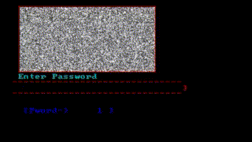

# QuickBasic files from 1998

When I was quite young, I had a computer with an Intel 80386 (33MHz) processor. I had to make do with this beige monstrosity
until I got my Pentium II in 1999. Because there wasn't much to do on a 386 (except for exploring every nook and cranny of Windows 3.11
and playing shareware games), I started fiddling around with QuickBasic 4.5, which was apparently included with MS-DOS 6.22.

I had no idea what I was doing, but I remember the fun of experimenting.

The included files are somewhat presentable and amusing. I uploaded them for nostalgia's sake, and to have an extra programming language
featured on my GitHub profile, of course.

## 3DCRCLE.BAS
An attempt of creating a 3D animation of a sphere.

## 3HOEK.BAS
A program to draw a triangle on the screen, points are movable with the arrow keys.

## BADSCR.BAS
  
A very badass hackerman 90's style login screen.

## BINARY.BAS
Basically the green Matrix code animation before it existed yet.

## DOS.BAS
  
Fake MS-DOS prompt to prank my sister.

## GOK.BAS
Higher/lower game, including a cheat mode.

## LINE.BAS
Something resembling a drawing program. You can move the cursor with the arrow keys, and draw shapes on the screen.

## SHOOTAR.BAS
The start of a game, in which two players could move a spaceship and shoot at each other. Once your ammo was gone, it would just continue
counting in negative numbers, mindblowing.

